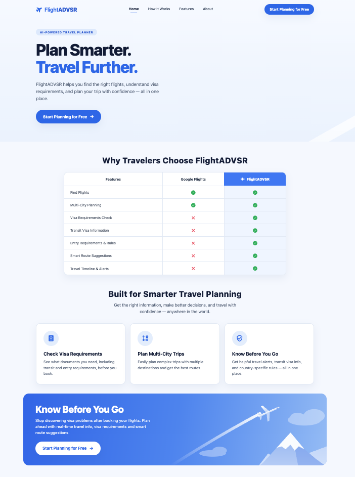
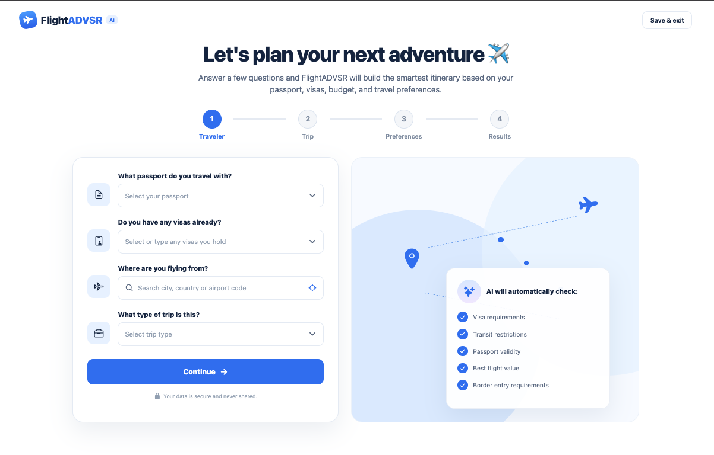
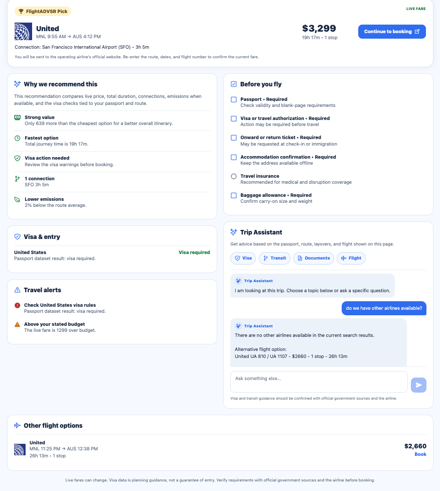

# FlightADVSR — AI-Powered Travel Planner

**Student:** Neri Bautista  
**Course:** Practical Submission — SPARE (25 pts)  
**Professor:** Steven Singer  
**Semester:** Spring 2026  

---

## 🛫 What I Built

**FlightADVSR** is an AI-powered travel planner for web and mobile. It finds live flights for your trip, checks visa and entry requirements for your passport, and recommends the itinerary that balances price, travel time, connections, and visa simplicity — all before you book.

Travelers answer a short guided planner (passport, route, dates, budget, and preferences). FlightADVSR then:

- Searches **live fares** for the route, dates, cabin, and number of travelers
- Checks **visa requirements** for the destination and every planned stop, based on the traveler's passport (199 passports)
- Picks a **FlightADVSR Pick** and explains *why* it was chosen
- Flags **travel alerts** such as visa action needed, tight or very long connections, and going over budget
- Builds a **pre-flight checklist** of documents to prepare
- Answers follow-up questions in a **Gemini-powered Trip Assistant** that knows the traveler's itinerary
- Opens **Google Flights on the exact recommended flight** so the traveler can book without searching again

**Live App:** https://flightadvsr-app.vercel.app/  
**GitHub:** https://github.com/neribautista/flightadvsr

---

## 🛠 Tools & Technologies Used

| Category | Technology |
|----------|-----------|
| Framework | React Native + Expo SDK 51 (web + mobile) |
| Language | TypeScript |
| Routing | Expo Router (file-based routing) |
| AI | Google Gemini API (Trip Assistant) |
| Live flights | Scrape.do Google Flights API |
| Airport data | OpenFlights via `airport-codes` (≈5,500 airports in 230 countries) |
| Country data | `i18n-iso-countries` + local Passport Index JSON (199 passports) |
| Graphics | `react-native-svg`, `expo-linear-gradient`, `@expo/vector-icons` |
| State | React Context (`TripContext`) |
| Deployment | Vercel (static Expo web export) |
| Package Manager | npm |

---

## ✨ Key Features

### 1. Homepage
A landing page that introduces FlightADVSR, compares it with Google Flights (visa checks, transit visa info, entry rules, route suggestions, alerts), and leads into the trip planner.

### 2. Guided Trip Planner (4 steps)
1. **Traveler** — passport country, visas already held, departure airport, and trip type.
2. **Trip** — destination, optional extra stops, round-trip or one-way, dates, number of travelers, total budget and currency, and notes.
3. **Preferences** — cabin class, route priority (best value, lowest price, shortest duration), preferred departure time, preferred and avoided airlines, maximum stops and layover length, checked baggage, flexible dates, hotel recommendations, and accessibility needs.
4. **Results** — the recommended journey (see below).

A live preview panel summarizes the trip as it's being built.

### 3. Worldwide Airport Search
Departure, destination, and extra-stop fields search ≈5,500 airports in 230 countries by **city, country, airport name, or IATA code**. Major hubs rank first (typing "Kenya" suggests Nairobi, "Peru" suggests Lima), and common short names like "UK", "USA", and "UAE" work. Extra stops are chosen by the traveler — nothing is added automatically.

### 4. Live Flight Search & Analysis
The analyzing screen runs the live flight search straight away. Cabin class, number of travelers, stop limits, dates, and currency are applied to the search. The checklist on screen tracks the real search and redirects to results as soon as all checks are complete.

### 5. FlightADVSR Pick (Explainable Recommendation)
Every returned itinerary is ranked on price, total duration, number of stops, layovers longer than the traveler's limit, carbon emissions, and visa simplicity. The results page shows the pick with up to five plain-language reasons (for example "Strong value — only $639 more than the cheapest option", "1 connection — SFO 3h 5m", "Lower emissions"), plus other live flight options.

### 6. Visa & Entry Checks
Visa status for the destination and every planned stop is looked up from the local passport dataset (visa-free, visa on arrival, eVisa/ETA, or visa required), with the allowed stay where known. Results link visa warnings to travel alerts and the checklist, and always advise confirming with official government sources.

### 7. Travel Alerts & Pre-Flight Checklist
- **Alerts:** visa action needed, tight connections (under 75 minutes), long layovers (over 8 hours), and fares above the stated budget.
- **Checklist:** passport, visa or travel authorization, onward or return ticket, accommodation confirmation, travel insurance, and baggage allowance.

### 8. Trip Assistant (Gemini)
A chat on the results page that answers questions using the traveler's passport, visas, route, layovers, visa results, and flights shown on the page. Quick topics cover **Visa**, **Transit**, **Documents**, and **Flight**, and it can list alternative airlines from the live results. Answers are short, plain text, and never guarantee entry or boarding.

### 9. Book Without Searching Again
**Continue to booking** opens Google Flights with the recommended flight, date, cabin, and travelers already selected:
- **One-way:** lands on the booking options page for that exact flight, one click from the airline's checkout.
- **Round trip:** the outbound flight is preselected; the traveler picks a return and books.

### 10. Dashboard & Quick Visa Lookup
**Save & exit** in the planner opens a dashboard with a quick chat for route questions like `JFK to Tokyo` or `PHL to AUS`. It detects domestic vs. international routes and returns the visa status for the selected passport.

---

## 📁 Project File Structure

```
flightadvsr-app/
├── app/
│   ├── index.tsx              # Homepage
│   ├── dashboard.tsx          # Dashboard with quick visa-lookup chat
│   ├── _layout.tsx            # Root layout (Expo Router stack + TripProvider)
│   ├── +not-found.tsx         # 404 fallback route
│   └── onboarding/
│       ├── traveler.tsx       # Step 1: passport, visas, departure airport, trip type
│       ├── trip.tsx           # Step 2: destination, stops, dates, travelers, budget
│       ├── preferences.tsx    # Step 3: cabin, priority, airlines, stops, essentials
│       ├── analyzing.tsx      # Live search + analysis progress
│       └── results.tsx        # FlightADVSR Pick, visa, alerts, checklist, Trip Assistant
├── components/
│   ├── Scenery.tsx            # SVG mountain/plane illustration on the homepage
│   ├── onboarding/            # Step progress bar and calendar date picker
│   └── FlightCard.tsx, VisaBanner.tsx, PassportSelector.tsx  # Dashboard components
├── context/
│   └── TripContenxt.tsx       # Shared trip state across the planner
├── services/
│   ├── flightService.ts       # Scrape.do Google Flights search
│   ├── journeyService.ts      # Recommendation, reasons, alerts, checklist
│   ├── aiService.ts           # Visa lookups + Gemini Trip Assistant
│   └── googleFlightsLink.ts   # Google Flights link to the exact recommended flight
├── data/
│   ├── airports.json / .ts    # Worldwide airport list + search
│   ├── countries.ts           # Passport country options
│   └── passportIndex.json     # Visa rules for 199 passports
├── scripts/
│   └── build-airports.js      # Regenerates data/airports.json
├── screenshots/               # README screenshots
└── types/trip.ts              # Shared TypeScript types
```

---

## ⚙️ How to Run Locally

```bash
# Clone the repository
git clone https://github.com/neribautista/flightadvsr.git
cd flightadvsr

# Install dependencies
npm install

# Start development server
npx expo start --clear

# Open in browser
Press W to open web
```

**Environment Variables Required:**  
Create a `.env.local` file (see `.env.example`):
```
EXPO_PUBLIC_GEMINI_API_KEY=your_gemini_api_key
EXPO_PUBLIC_GEMINI_MODEL=gemini-2.5-flash
EXPO_PUBLIC_SCRAPE_DO_TOKEN=your_scrape_do_token
```

> `EXPO_PUBLIC_` values are bundled into the app. That's fine for this prototype, but before a public launch the Gemini and Scrape.do calls should move behind a backend so the keys stay private.

**Regenerating the airport list** (only needed to change which airports are included):
```bash
node scripts/build-airports.js
```

---

## 📸 Screenshots

### Homepage


### Trip planner, step 1: Traveler


### Results and Trip Assistant


---

## 🎓 Reflection

This project pushed me to apply real-world software engineering practices under a tight deadline — one week from idea to deployed product. The biggest lesson was that **building something real surfaces problems that tutorials never show you**: bundler incompatibilities, routing edge cases, API integration quirks, and UI issues that only appear on actual devices.

The experience of shipping a live, working AI-integrated application is something I'll carry directly into my career.

---

*Built with 💙 in one week | Spring 2026 | FlightADVSR*
